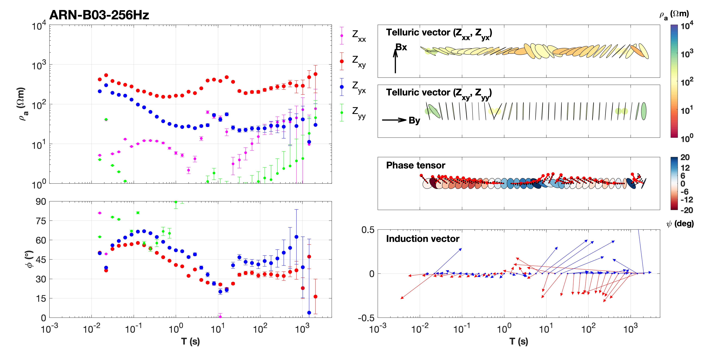
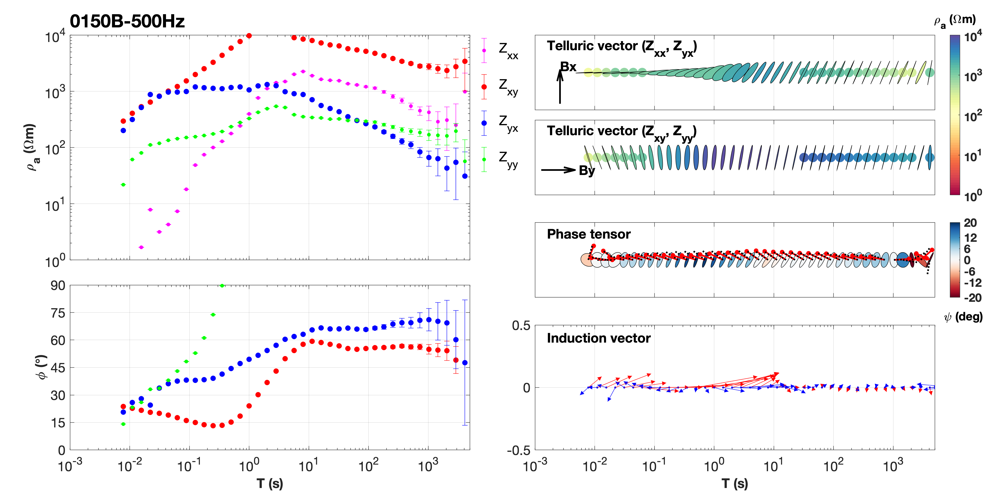
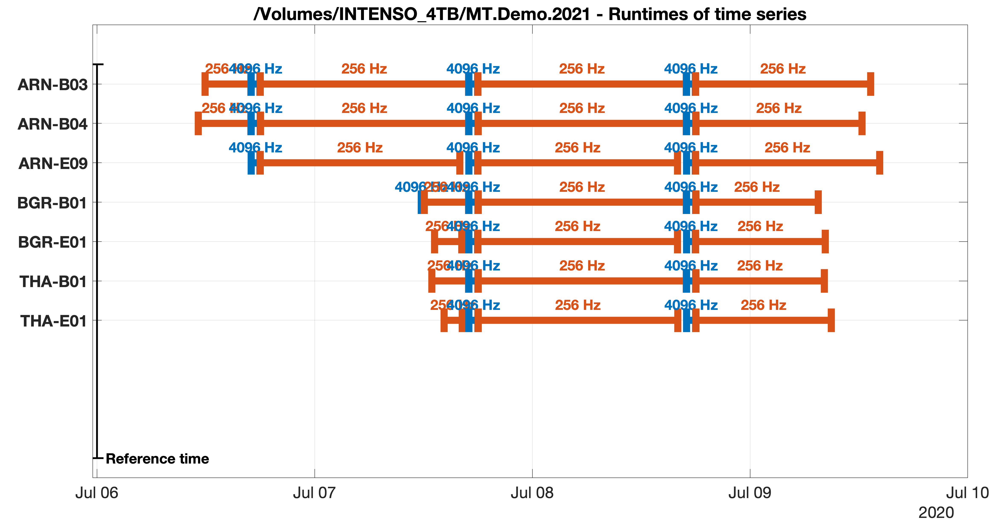
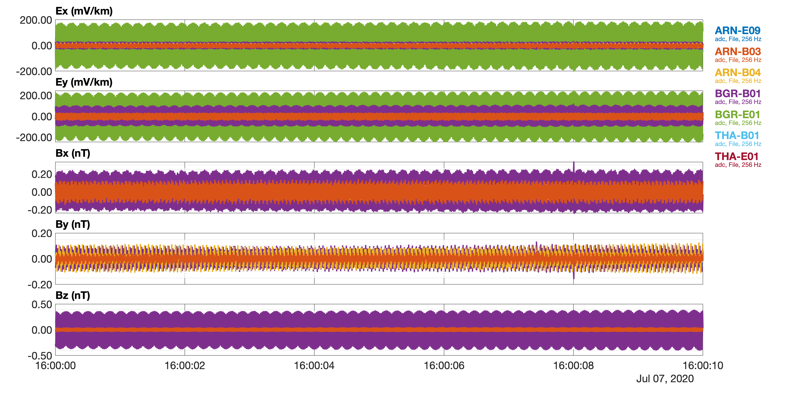
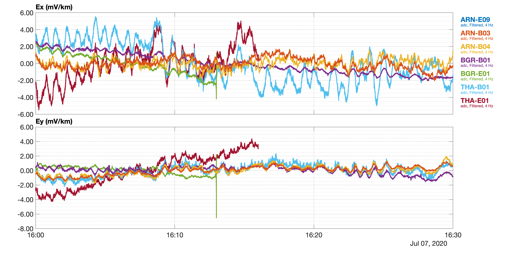
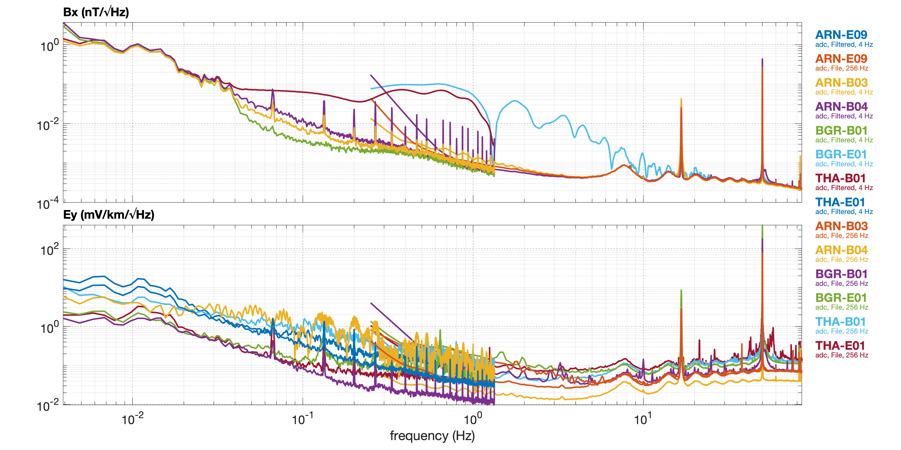
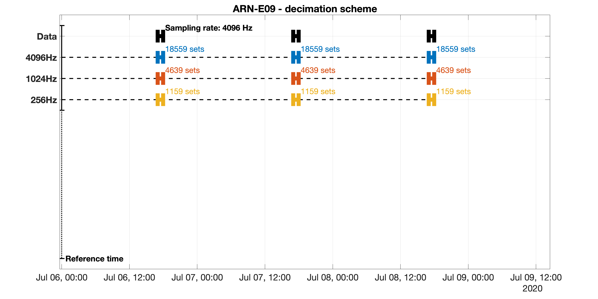
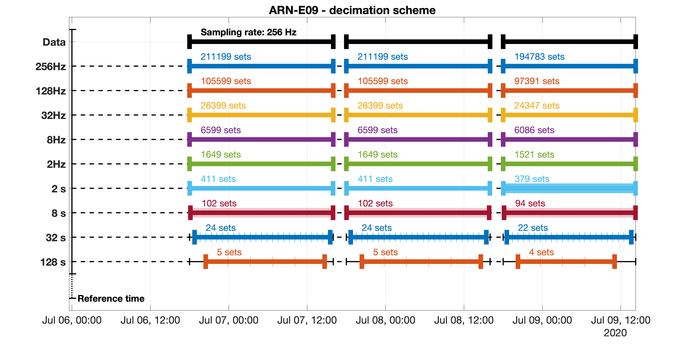

.. _magnetotellurics:

Magnetotellurics
=================

.. Start of roles definitions

.. raw:: html

    

.. role:: red
.. role:: blue
.. role:: green
.. role:: special

MT processing determines the bivariate transfer function between the horizontal electric
and vertical magnetic field components, :math:`E_{x}`, :math:`E_{y}` and :math:`B_{z}`,
and the two horizontal magnetic field components :math:`B_{x}` and :math:`B_{y}` in frequency domain. :math:`E_{x}`,
:math:`E_{y}` and :math:`B_{z}` are denoted as :red:`output channels`, or predicted channels,
and :math:`B_{x}` and :math:`B_{y}` are the :blue:`input channels`, or predicting channels.

In standard MT setups, both the output and the input channels are recorded at the same location. A processing
that uses channels from one single site is commonly denoted as **single-site** processing. In turn,
**inter-site processing** relates output and input channels from separate sites. We denote
the site that recorded the input channels as the :blue:`base site` and the site that recorded the output
channels as the :red:`local site`. In addition, single-site or inter-site processing estimates can sometimes
be enhanced with a recording from a (clean) :green:`remote reference site`. The
reference channels correspond to the input channels, and the processing that uses reference channels to improve the estimates
is denoted as **remote-reference processing**.

To generalize this, we solve the bi-variate regression problem

.. math::

  {\cal O}_{i}(\omega)={\cal T}_{i,1}(\omega){\cal I}_{1}(\omega)+{\cal T}_{i,2}(\omega){\cal I}_{2}(\omega)+{\cal E}_{i}(\omega)\,\,\,,

where :math:`{\cal I}_{1,2}` denote the two input channels and :math:`{\cal O}_{i}` is the :math:`i\textrm{-th}` output channel.
This equation applies to both single-site and inter-site processing and we offer the flexibility to define arbitrary channel combinations - with
the only constraint that the neither input channels nor output channels are mixed across different stations, respectively.

.. raw:: html

  <video width=700" controls>
  <source src="Skineffect.mp4" type="video/mp4">
  Your browser does not support the video tag.
  </video>

*A bit of physics behind the MT method:* Animation to illustrate the skin-effect that describes the frequency-dependent attenuation of
a plane wave electric field with depth. The amplitude of the field distribution decays exponentially
as :math:`\sim e^{kz}`.  :math:`\delta` is the skin-depth, where the field has reached :math:`1/e` of the surface amplitude.

Black-box examples
-------------------

We first provide black box examples which make use of default settings and which to not provide any diagnostics. In case of
high-quality data, these examples should readily give usable MT transfer functions.

``ADU`` and ``EDE`` processing
+++++++++++++++++++++++++++++++

We use a test data set that has been recorded with 5-ch ``ADU`` systems
and two-channel ``EDE`` systems in the Sauerland and the Harz mountains, Germany. ``ADU`` site names are ``ARN-B03``,
``ARN-B04``, ``BGR-B01`` and ``THA-B01``; ``EDE`` site names
are ``ARN-E09``, ``BGR-E01`` and ``THA-E01``. At these sites, GPS synchronized recordings are available at several runs with :math:`4096\,\text{Hz}`
and :math:`256\,\text{Hz}` sampling rates, respectively. The measurement commenced on 07 June 2020.

*Note: Some of the data used in the demo project are pretty noisy and shall only serve to illustrate the processing code.*

First, we organize the data into a project folder structure, following the guidelines in the previous section (see :ref:`gettingstarted`). We name the project as: ::

  /Volumes/INTENSO_4TB/MT.Demo.2020

Within this project (= folder name), we store the ``ADU`` recordings in::

  ./ARN-B03/ts/adc/ADU/meas*/*.ats
  ./ARN-B04/ts/adc/ADU/meas*/*.ats
  ./BGR-B01/ts/adc/ADU/meas*/*.ats
  ./THA-B01/ts/adc/ADU/meas*/*.ats

and the ``EDE`` recordings in::

  ./ARN-E09/ts/adc/EDE/meas*/*.ets
  ./BGR-E01/ts/adc/EDE/meas*/*.ets
  ./THA-E01/ts/adc/EDE/meas*/*.ets

Calibration files for the employed induction coils (MFS06, MFS07) are to be copied into the default folder for calibration files::

  ./s/*

*Note: Theoretical calibration functions are available for Metronix induction coils and will be used in case that the measured
calibration files are not available.*

To process the data, a script has to produced (see :ref:`gettingstarted`) that contains the desired instructions, structured
essentially into three sections: (1) importing data, (2) computing spectra and (3) estimating transfer
functions.

* **Single-site black-box processing**

A script to perform automated single-site processing on site ``ARN-B03`` using all default processing parameters can
be as short as follows:

.. code:: matlab

  %% Initialize
  mt = MT('/Volumes/INTENSO_4TB/MT.Demo.2020', datetime(2020,06,07));
  % Import time series for station ARN-B03, single site processing
  mt.import('ARN-B03');
  %% Compute Spectra
  mt.spectra;
  %% Estimate transfer functions
  mt.estimate;

The :ref:`mt` class interprets the imported site as the :red:`local site` (because only one site is imported) and thus
performs a single-site processing using the standard MT channel combinations to estimate the impedance tensor and the vertical magnetic transfer
function (if :math:`B_z` is available). The processing will merge all runs at the same sampling rate for transfer function estimation, and loop over all available sampling rates.
In this example, data recorded at :math:`4096\,Hz` and :math:`256\,Hz` sampling rate are processed.

The code should run through (may take a while though, but continuous output is produced to inform the progress) while computing and
storing spectra and transfer functions (subdirectory trees are created if not existing) separately for each sampling rate.  An error is in almost all cases due to some
issue with the data files, the folder structure or missing files (e.g. calibration files). Using::

  mt.plotmtsounding;

a figure of the last processing result will be produced (which is in this case the :math:`256` Hz run). The result looks as this
(as noted, the demo data are somewhat noisy):

*MT response functions obtained from black-box single site processing of site* ``ARN-B03``. Left panels show apparent resistivities and phases,
right panels show, from top to bottom, telluric vectors (see Becken et al., 2002), the phase tensor (Caldwell et al., 200x; Booker et al., 201x)
and the induction vectors (Wiese, 19xx).

As the default, spectra are stored in ::

  ./ARN-B03/fc/*

and transfer functions are stored in ::

  ./ARN-B03/tf/*

* **Inter-site black-box processing**

To perform inter-site processing, provide the :blue:`base site` as the second argument to the import call.
For instance, we wish to process the telluric recording at ``ARN-E09`` against the horizontal magnetic channels at the site ``ARN-B03``.
Then (omitting the initialization call), use:

.. code:: matlab

  % Import time series for station ARN-E09, ARN-B03, inter-site processing
  mt.import('ARN-E09', 'ARN-B03');
  %% Compute Spectra
  mt.spectra;
  %% Estimate transfer functions
  mt.estimate;

* **Remote-reference**

A remote-reference site can be passed as the third argument, e.g., using the :green:`remote site` in the Harz, ``BGR-B01``:

.. code:: matlab

  % Import time series for station ARN-E09, ARN-B03, BGR-B01, inter-site
  % remote reference processing
  mt.import('ARN-E09', 'ARN-B03','BGR-B01');
  %% Compute Spectra
  mt.spectra;
  %% Estimate transfer functions
  mt.estimate;

The ``MT`` class thus interprets the order of arguments upon import in terms of the objectives of single-site, inter-site
or remote reference processing as follows:

.. code:: matlab

  % single-site
  mt.import(localsite);
  mt.spectra;
  mt.estimate;

.. code:: matlab

  % inter-site
  mt.import(localsite,basesite);
  mt.spectra;
  mt.estimate;

.. code:: matlab

  % standard remote reference
  mt.import(localsite,[],remotesite);
  mt.spectra;
  mt.estimate;

.. code:: matlab

  % inter-site remote reference
  mt.import(localsite,basesite,remotesite);
  mt.spectra;
  mt.estimate;

If more sites are passed to the import routine, the first three are interpreted as shown above. Naturally,
these definitions can be overwritten, as described below.

``Lemi`` processing
+++++++++++++++++++++

``Lemi`` data are recognized upon import, if provided in the correct folder tree. We currently support recordings
of type ``B423`` only (``B423`` is the extension of the data files.) For ``Lemi`` data, we expect that the ``B423`` time series
are stored in (for example for site ``0150B``) ::

  ./0150B/ts/adc/B423/meas*/*.B423

as the default. Unfortunately, the header information in the data files is incomplete. Therefore, the import routine searches for an extra text file (``siteinfo.txt``)
in each data folder with the missing information, or generates a default ``siteinfo.txt`` template, which can be manually edited. This text file is read during import.
Therefore, after editing ``siteinfo.txt``, the import call must be issued again. See :ref:`recorder` for details.

Once, the data can be read correctly, the very same processing instructions as described above (and below) apply also to ``Lemi`` data. For the example above, where :math:`500` Hz
data were acquired, we use the script

.. code:: matlab

  mt  = MT('/Volumes/INTENSO_4TB/MT.Mongolia.2020', datetime(2020,10,01));
  mt.import('0150B');
  mt.spectra;
  mt.estimate;

and obtain the following result (using ``mt.plotmtsounding;``):

*MT response functions obtained from black-box single site processing of site* ``0150B``, recorded in Mongolia at a sampling rate of :math:`500` Hz.
and the induction vectors (Wiese, 19xx).

Step-by-Step guide
-------------------

The ``MT`` class design
++++++++++++++++++++++++++++++++++++++++++++++

The :ref:`mt` class is not much more than a batch that shall make it
convenient to process MT data. A :ref:`mt` object, given the variable
name, say, ``mt``, is instantiated during the initialization::

  mt = MT(projectname,datetime(yyyy,mm,hh));

and has the following important fields:

.. code:: matlab

  mt.ts
  mt.sp
  mt.tf
  mt.mtset

``mt.ts`` is an :ref:`emts` object, ``mt.sp`` is an :ref:`emsp` object and ``mt.tf`` is an :ref:`emtf` object. ``mt.mtset`` is an
:ref:`mtsettings` object and stores some settings relevant to MT. To set these settings, use the syntax

.. code:: matlab

  mt.setset(prop1,value1,prop2,value2,..)

and pass the relevant property-value pairs as arguments.

The actual processing relies largely on the methods provided by the :ref:`emts` and :ref:`emsp` classes, and transfer functions are handled by :ref:`EMTF`.
To control the processing, the parameters to the various methods can be passed either by ``set*`` methods
or by passing property-value pairs directly to a method call.

Particular ``set*`` methods (omitting the ``mt.`` prefix, because the ``ts``, ``sp`` and ``tf`` objects can also live on their own) are:

.. code:: matlab

  mt.setset(), mt.setlocal(), mt.setbase()  % set properties of mt.mtsettings, which holds specific MT settings,
    % and of mt.emset, a copy of which is also a property of mt.ts.emset, mt.sp.emset and mt.tf.emset
  mt.setfilter()                            % set properties of mt.ts.emfilt
  mt.setdecimation()                        % set properties of mt.ts.emdec
  mt.setspectra()                           % set properties of mt.ts.emspec
  mt.settsplot()                            % set properties of mt.ts.emspec
  ..
  mt.setbandsetup()                         % set properties of mt.sp.embs
  mt.setspplot()                            % set properties of mt.sp.emplot
  ..
  mt.settfplot()                            % set properties of mt.tf.emplot
  % to be completed

An overview of the particular method names, which apply these settings, is given in the following:

.. code:: matlab

  mt.import(), mt.clear()
  mt.ts.readdata()
  mt.ts.filterdata()
  mt.ts.plottimeseries()
  mt.ts.writeats()
  mt.ts.quicklookspectra()
  mt.ts.plotdecimationscheme()
  mt.ts.writespectra()
  ...
  mt.sp.import(), mt.sp.clear()
  ...
  mt.tf.import(), mt.tf.clear()
  mt.tf.plotmtsounding()
  % to be completed

We go through these methods in the sections below.

*See also:* :ref:`emts`, :ref:`emsp`, :ref:`emtf`, :ref:`mtsettings`

Initialize, import time series, data overview
++++++++++++++++++++++++++++++++++++++++++++++

An arbitrary number of sites can be imported in one call. To initialize
the demo project and to import all available sites, use:

.. code:: matlab

  mt  = MT('/Volumes/INTENSO_4TB/MT.Demo.2020', datetime(2020,07,06));
  mt.import('ARN-B03','ARN-B04','ARN-E09','BGR-B01','BGR-E01','THA-B01','THA-E01');

The import routines display some summary information during execution, such as sitenames, run numbers, pathnames, etc.. Sites can
only be imported into an existing project (i.e. a project that has been initialized before). If the project exists and
contains already sites (because the ``import`` had
been issued before), new sites are appended or they replace any existing sites of the same name. If the data reside in non-default directory trees,
the import methods will not find them. The default folder structure is defined in :ref:`emsettings` (see there how to change default search paths)
and described in the section on :ref:`recordingsystems`.

*Note:* As described above, the first three sites are assigned as the :red:`local site`, :blue:`base site` and :green:`reference site`, respectively.

*Note*: ``MT`` searches for all time series, spectra files and transfer functions (n/a). Since no spectra and transfer functions are
available at the beginning, a warning will be issued during the attempt to import them. To avoid automated import of
spectra files and/or transfer functions (if existing), set the corresponding switches of ``mt.mtset`` ( see :ref:`mtsettings` for details), to false, e.g.

.. code:: matlab

    mt.setset('ImportTimeSeries',true);
    mt.setset('ImportSpectra',false);
    mt.setset('ImportTransferFunctions',false); % n/a

The default value for these switches is ``true``.

*Note:* ``Import`` generally means that only the header information of each data file is extracted and stored, at least for the large data files.
Actual time series or spectra files are usually too big to store in memory for an entire project.

It may be of interest to clear a site that had been imported. The ``clear`` method works in the same way as the import method, using the syntax

.. code:: matlab

  mt.clear('ARN-E09','BGR-E01','THA-E01');

to clear the listed sites. To clear only time series, for instances, set the corresponding ``Clear*``, e.g.,

.. code:: matlab

    mt.setset('ClearTimeSeries',true);
    mt.setset('ClearSpectra',false);
    mt.setset('ClearTransferFunctions',false); % n/a

to either true and false, respectively. The default value for these switches is ``true``.

*See also:* :ref:`emts`, :ref:`emsp`, :ref:`emtf`, :ref:`emsettings`, :ref:`mtsettings`,

**Sitemap**

A good way to get started with processing of MT data is to generate a map. We use the Matlab ``geoaxes`` map
utilities, a convenient way to plot geographical data. The default map layout uses :code:`basemap='topographic'`.

To plot site locations on a map, use the ``plotsitemap`` method of either :ref:`emts`, :ref:`emsp` or :ref:`emtf` and
provide the latitude and longitude limits of the survey area.

.. code:: matlab

  mt.ts.plotsitemap('LatitudeLimits',[50.2, 52.7],'LongitudeLimits',[7,12]);
  mt.sp.plotsitemap('LatitudeLimits',[50.2, 52.7],'LongitudeLimits',[7,12]);
  mt.tf.plotsitemap('LatitudeLimits',[50.2, 52.7],'LongitudeLimits',[7,12]); % n/a

The former plots the sites for which time series have been successfully imported, the latter
plots the sites for which spectra or transfer functions are available and imported. Note that coordinates are extracted for
the first available run for each available site.

.. image:: DemoSiteMap.png
  :width: 900px
  :align: center
  :alt: alternate text

*Sitemap displaying the sites contained in the demo project.* A zoom button can be activated on the top right of the
Matlab figure, or zooming can be performed with gestures applicable to the computer in use.

To store the map as a graphics file, we recommend using

.. code:: matlab

  print(gcf,'-dpng','-r300','mapname.png');

*See also:* :ref:`emts`, :ref:`emtplot`, :ref:`emsp`, :ref:`emfplot`,

**Runtimes plot**

Another important plot that helps preparing processing is a runtimes plot. Runtimes plots are available for both
time series and spectra data and can be invoked with:

.. code:: matlab

  mt.ts.plotruntimes;
  mt.sp.plotruntimes;

where the former refers to imported time series data and the latter to imported spectra data. Runtimes for the demo project are
summarized as follows:

*Runtimes plot*, displaying the available time series data in the demo project, separated into available sampling rates.

Use this plot to identify time windows of interest, e.g. for plotting time series.

*Note:* Time series and spectra must not always cover the same time span, because spectra can also be
computed on only a subset (e.g. certain time range, sampling rates) of data.

*Note:* The runtimes plot replaces the sitemap axes in the figure generated above, if existing. This is because the figure handle is stored and
re-used (with the idea to plot the figures into handles contained in a GUI - some time in the future). To release any plot related
to time series, use:

.. code:: matlab

  mt.ts.emplot.hparent = [];

This will generate a new figure with the next plotting command. An equivalent syntax applies to spectra and transfer function figures.

Selecting and plotting time series (subsets)
++++++++++++++++++++++++++++++++++++++++++++

We provide a number of selection criteria to read portions of time series data, e.g. for plotting or spectra estimation. The entry keys include selection of
(a) site(s) (b) tag(s) (c) sampling rate(s) (d) channel(s) and (e) time window. Specifically, we discriminate between a :red:`local site`
and a number :blue:`base site(s)`. For example, to define and read a :math:`10\, s` time window of site ``ARN-E09`` (a telluric recording
that has only electric channels), we can use the following command:

.. code:: matlab

  mt.ts.readdata('LocalSite','ARN-E09','LocalSamplingRate',256,'LocalTag','adc', ...
    'Channels',{'Ex' 'Ey'},...
    'Time',[datetime(2020,07,07,16,0,0),datetime(2020,07,07,16,0,10)]);

The ``readdata()`` method passes all property-value argument pairs to :ref:`emsettings` and than reads the data as specified by these criteria.
The read data are stored in a :ref:`emtdata` object (``ts.lsite``, lsite is short for local site). Accordingly, sites can be defined to become
a :blue:`base site`, and data can be read correspondingly. Base site data are stored in ``ts.bsite``.

To clear memory from local or base site time series, set ``'LocalSite','none'`` or ``'BaseSite','none'``, respectively.

One will hardly ever need access to the data itself; it is rather of interest to plot the time series to identify signal
as well as issues in the time series, such as broken channels or synchronization errors. Ideally, synchronized time series
from different sites are plotted one on top of another for selected data subsets for this purpose. The method

.. code:: matlab

  mt.ts.plottimeseries;

accomplished this task. ``plottimeseries()`` plots the data that have been read before into memory; if the ``readdata()`` method had not
been called before, or some relevant selection have changed, ``plottimeseries()`` will trigger a re-reading of the data before plotting.

As a shortcut, ``plottimeseries()`` accepts property value-pairs to overwrite current settings, i.e. without explicitly calling ``mt.setset()``.
As an example, we plot the :math:`10\, s` time window for the local site and number of base sites as follows:

.. code:: matlab

  mt.ts.plottimeseries('LocalSite','ARN-E09','LocalSamplingRate',256,'LocalTag','adc', ...
    'BaseSite',{'ARN-B03','ARN-B04','THA-B01','THA-E01' ,'BGR-B01','BGR-E01'},'BaseSamplingRate',256,'BaseTag','adc', ...
    'Channels',{'Ex' 'Ey' 'Bx' 'By' 'Bz'},...
    'Time',[datetime(2020,07,07,16,0,0),datetime(2020,07,07,16,0,10)]);

The ``plottimeseries()`` passes all property-value pairs to :ref:`emsettings` (to select the data) and :ref:`emtplot` (to control plot
appearance), then invokes the ``readdata()`` method and plots the result. This could look like this:

*Time series plot.* A :math:`10\, s` time series example for the local site  ``ARN-E09`` (listed first in the legend) and a number of base sites.
The time series in all channels are dominated by the :math:`50` Hz power network.

*Note:* Be careful not to load too many data at once into memory (i.e. too long time series);

*See also:* :ref:`emts`, :ref:`emsettings`, :ref:`emtplot`,

Filter, decimation and resampling options
+++++++++++++++++++++++++++++++++++++++++++

Some filter options are available, including decimation, resampling, delay filtering (n/a) and notch filtering (n/a). The primary use of filtering is
for displaying filtered time series; later on, the decimation filter will be used prior to spectral estimation in a cascaded fashion, and resampling may be
useful when combining data that were recorded at different sampling schemes (e.g. at :math:`500` Hz and :math:`512` Hz).

The ``filterdata()`` method operates on the local and base site time series that are stored in memory (i.e. in the ``lsite`` and ``bsite`` properties). To
filter data, use - as an example - a syntax as follows.

.. code:: matlab

  mt.ts.filterdata('ResamplingFrequency',512,'DecimationFactor',[8 8])

This will first resample the data to :math:`512` Hz (regardless of the original sampling rate) and then decimate by a factor
of :math:`8\times8=64`.
Property-values pairs are used to set the filter properties (see :ref:`emtfilter` and the ``setfilter``
method of :ref:`emts` for details). The filtered data are stored in the fields ``ts.ltsfiltered`` and ``ts.btsfiltered``.

*Note:* The decimation scheme uses the matlab function ``decimate``, which can take any integer value as the decimation factor, but it is recommended to
decimate by less than about a factor of 10. Higher decimation rates are accomplished by successive decimation, using e.g. the value [8 8] to
call the ``decimate`` functions two times, with a decimation factor of :math:`8` each.

The ``filterdata()`` method also accepts property-value pairs to set global settings (see :ref:`emsettings`), e.g.,

.. code:: matlab

  mt.ts.filterdata('LocalSite','ARN-E09','LocalSamplingRate',256,'LocalTag','adc', ...
    'BaseSite',{'ARN-B03','ARN-B04','THA-B01','THA-E01' ,'BGR-B01','BGR-E01'},'BaseSamplingRate',256,'BaseTag','adc', ...
    'Channels',{'Ex' 'Ey' 'Bx' 'By' 'Bz'},...
    'Time',[datetime(2020,07,07,16,0,0),datetime(2020,07,07,16,0,10)],...
    'DecimationFactor',[8 8]);

which will cause re-reading of the time series, because the data selections have changed.

As said, we use the filter function in the first place to plot filtered (e.g. decimated) time series. The
``plottimeseries()`` method (see above) also accepts
filter property-value pairs, and then applies them to the data.
For plotting, set the pair ``'Stage','Filtered'`` to plot the filtered data
instead of the original time series, or set the pair ``'Stage',{'File','Filtered'}`` to plot the filtered data on top of raw time series.

As an example, the command

.. code:: matlab

  mt.ts.plottimeseries('LocalSite','ARN-E09','LocalSamplingRate',256,'LocalTag','adc', ...
    'BaseSite',{'ARN-B03','ARN-B04','THA-B01','THA-E01' ,'BGR-B01','BGR-E01'},'BaseSamplingRate',256,'BaseTag','adc', ...
    'Channels',{'Ex' 'Ey'},...
    'Time',[datetime(2020,07,07,16,0,0),datetime(2020,07,07,16,30,00)],...
    'DecimationFactor',[8 8],'Stage','Filtered');

generates a :math:`30` min plot of time series data downsampled from :math:`256` Hz to :math:`4` Hz:

*Filtered time series*, applied to a :math:`30` min. time window and using a decimation factor of :math:`64`. At the reduced sampling rate,
continuous pulsations are visible, which are otherwise hidden below the :math:`50` Hz signal.

*See also:* :ref:`emts`, :ref:`emtfilter`, :ref:`emtplot`

Quick-look spectra
+++++++++++++++++++++++++++++++++++++++++++
As an example, the command

.. code:: matlab

  mt.ts.plotquicklookspectra('LocalSite','ARN-E09','LocalSamplingRate',256,'LocalTag','adc', ...
    'BaseSite',{'ARN-B03','ARN-B04','THA-B01','THA-E01' ,'BGR-B01','BGR-E01'},'BaseSamplingRate',256,'BaseTag','adc', ...
    'Channels',{'Bx' 'Ey'},'Time',[datetime(2020,07,07,20,0,0),datetime(2020,07,08,08,0,0)], ...
    'Windowlength',2^12,'Overlap',2^10,'Taper','Hanning',...
    'DecimationFactor',[8 8],'Stage',{'Filtered','File'});

generates a PSD plot using :math:`12` h of data, both for the original sampling rate of
:math:`256` Hz and the decimated data at :math:`4` Hz:

*Power spectral density (PSD)*, applied to a :math:`12` hours time window and using both the original data (:math:`256` Hz) and the
decimated data (:math:`256` Hz). The PSD is the square root of the averaged autospectra of each channel. Channels :math:`B_x` and  :math:`B_y`
are displayed. The PSDs show the characteristic similarity
of the :math:`B_x` component across all components, a rise in signal energy towards low frequencies, and wonderful Schumann resonances
at :math:`7.8` Hz and harmonics. However, noise is also apparent, such as the :math:`50` Hz peak (power network), :math:`16.67` Hz peak
(railway network), :math:`15` s and harmonics (corrosion protection current on gas pipelines), and some issues in the magnetics of site ``THA-B01``
and the electrics of ``ARN-B03``. These sites would need closer inspection.

*See also:* :ref:`emts`, `emtfilter`, :ref:`emtspectra`, :ref:`emtplot`

Cascade Decimation and writing spectra
+++++++++++++++++++++++++++++++++++++++++++

**Setting up cascade decimation**

.. code:: matlab

    mt.setdecimation(prop1,val1,prop2,val2,...)

Property-value pairs for to set the decimation scheme are:

.. code:: matlab

  'DecimationCascade',[1 4 4 4 4 4 4 4 4 4]
    % Decimation factor relative to the sampling rate of the previous decimation level
  'WindowLength',[128 128 128 128 128 128 128 128 128 128]
    % Length of time windows in number of samples
  'OverLap',[32 32 32 32 32 32 32 32 32 32]
    % Overlap of adjacent time windows in number of samples
  'Taper','Hanning'
    % Taper applied to the time windows prior to spectra computation. Options are 'Hanning' and
    % 'dpss' (discrete prolate spheroidal sequences)
  'PreWhitening',[-1 -1 -1 -1 -1 -1 -1 -1 -1 -1]
    % Prewhitening uses first oder differencing (-1) or nothing (0). Needs more sophisticated
    % schemes (in the future)

.. code:: matlab

  mt.ts.plotdecimationscheme('LocalSite','ARN-E09','LocalTag','adc','LocalSamplingRate',4096);

*Decimation scheme*,

.. code:: matlab

  mt.ts.plotdecimationscheme('LocalSite','ARN-E09','LocalTag','adc','LocalSamplingRate',256);

*Decimation scheme*,

*See also:* :ref:`emts`, :ref:`emdecimate`

**Computing and writing spectra**

text

Import Spectra
+++++++++++++++++++++++++++++++++++++++++++

*See also:* :ref:`emsp`

Selecting and plotting spectra (subsets)
+++++++++++++++++++++++++++++++++++++++++++

*See also:* :ref:`emsp`, :ref:`emfplot`, :ref:`emsettings`

Band Setup
+++++++++++++++++++++++++++++++++++++++++++

*See also:* :ref:`embandsetup`,

Transfer function estimation
+++++++++++++++++++++++++++++++++++++++++++

Plotting transfer functions
+++++++++++++++++++++++++++++++++++++++++++

Update Transfer function estimation
+++++++++++++++++++++++++++++++++++++++++++

Coherency masking
+++++++++++++++++++++++++++++++++++++++++++

Polarization masking
+++++++++++++++++++++++++++++++++++++++++++

Other masking
+++++++++++++++++++++++++++++++++++++++++++

Update Transfer function estimation
+++++++++++++++++++++++++++++++++++++++++++

Sequential processing
+++++++++++++++++++++++++++++++++++++++++++
