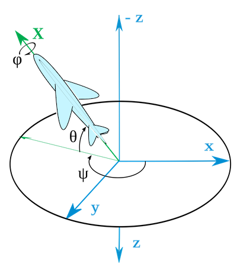

.. _recordingsystems:

Recording systems and channels
=========================================

.. Start of roles definitions

.. raw:: html

    

.. role:: red
.. role:: blue
.. role:: special

.. End of roles definitions

The ``Recorder`` superclass provides access to data files recorded by various recording systems and
stored in various formats. To handle the data properly, it is important to agree on some naming conventions
for recorder types and data types.

Typically, a single recorder has stored time series of multiple channels. We identify channels by channel
names. For example, a channel named ``Ex`` is understood as an electric field recording (e.g. from a
magnetotelluric measurement), and a channel named ``Yaw`` is an attitude estimate of a body (e.g. to describe
the attitude of an airborne system).

Here, we describe the supported ``Recorder`` types and the ``EMChannels``, which are recognized. Adding
new recorders and channels programmatically should be straightforward.

:blue:`Classes:` ``Recorder``, ``EMChannels``, ``EMSystems``

Overview of Recorders
-----------------------------------

Implemented ``Recorder`` subclasses are ``ADU``, ``EDE``, ``Lemi``, ``MagArrow``, ``GEM``,
``ArduPilot``, ``iNAT`` and ``XSens``. It is expected that the time series data files for
a particular project and site are stored in a (semi-flexible) archive structure, which has the structure::

	./<project>/<site>/ts/<searchpath>

where the default search paths are as: ::

	datapath    =   {...
		['./adc/ADU/meas*'], ['./adc/EDE/meas*'], ['./adc/Lemi/meas*'], ...
		['./adc/iNAT/meas*'], ['./adc/XSens/meas*'], ['./adc/ArduPilot/meas*'], ...
		['./adc/GEM/meas*'], ['./adc/MagArrow/meas*'], ...
		['./adc/Observatory/meas*']};

These default paths are defined in ``EMSettings`` and can be changed there, or by passing
respective property-value pairs to methods which access ``EMSettings`` objects; details
are provided elsewhere.

``ADU``, ``EDE`` and ``Lemi`` data file formats are recognized by their data file extensions
(``*.ats`` for ``ADU``, ``*.ets`` and ``*.mts`` for electric and magnetic ``EDE``, ``*.B423``
and ``*.B423E`` for five- and two-channel ``Lemi`` recorders, resp.); the remainder of
recorder types and their data formats are recognized by the combination of their data
file extensions and the ``Recorder`` name contained in the search path.

To import data, e.g. the ``EMTS`` class is invoked as follows: ::

	ts = EMTS(<projectpath>, <referencetime>);
	EMTS(ts,'Import',<site01>,<site02>,..);

Details are provided in the documentation for the ``EMTS`` class.

``EMTS`` recognizes the data type and uses the respective data class to read the corresponding
data files. ``EMTS`` is designed to store header information only and to read the data from
disc only when required. This works for binary data files (``ADU``, ``EDE``, ``Lemi``) but is
impractical for other data types (``MagArrow``, ``GEM``, ``ArduPilot``, ``iNAT``, ``XSens``)
for different reasons. For the latter data types, all data are held in memory after import
rather than on disc.

The ``EMTS`` class has options to filter and convert any sort of time series data into ``*.ats``
format. Therefore, the ``ADU`` recorder subclass can hold data from any of the system types
described in this tutorial. This may be useful in case of large data files. The ``EMTS`` class
has also options to estimate and store spectra (as ``*.asp``) for any sort of time series using
a flexible cascade decimation scheme along with a short-time Fourier transformation. In output
files, we identify the original recording system using 3-letter abbreviations, which is also
used to encode the system in file names when exporting to ``*.ats`` or ``*.asp`` files, for instance.
Short names are defined in the class ``EMSystems``.

Overview of Recorders, class names, short names and file naming conventions of original and
converted data files:

========== ============= ========== ====================== ========== =========
Name       Class         Short      Naming convention      conv. ts    spectra
========== ============= ========== ====================== ========== =========
ADU07e/08e ``ADU``       ``ADU``    ``*.ats``              ``*.ats``  ``*.asp``
EDE        ``EDE``       ``EDE``    ``*.ets``              ``*.ats``  ``*.asp``
                                    ``*.mts``
Lemi       ``Lemi``      ``LEM``    ``*.B423``             ``*.ats``  ``*.asp``
                                    ``*.B423E``
MagArrow   ``MagArrow``  ``MAR``    ``*.csv``              ``*.ats``  ``*.asp``
GemSys     ``GEM``       ``GEM``    ``gem_yyyy-mm-dd.log`` ``*.ats``  ``*.asp``
ArduPilot  ``ArduPilot`` ``ARP``    ``*.bin``              ``*.ats``  ``*.asp``
iNAT-iMAR  ``iNAT``      ``IMA``    ``*.csv``              ``*.ats``  ``*.asp``
                                    ``*.mat``
XSens      ``XSens``     ``MTI``    ``*.txt``              ``*.ats``  ``*.asp``
========== ============= ========== ====================== ========== =========

If you are unhappy with these conventions (particularly the short names), or wish to add recorders,
you can overwrite or change them in the ``EMSystems`` class definition.

Overview of Channels
----------------------------------

Channel names are defined in ``EMChannels`` and identify a particular channel. Short
channel names are 2-letter abbreviations used in file names when exporting data to ``*.ats``
or ``*.asp`` files, for instance. A sensor name is assigned a sensor sensitivity as the
default, and identified with a sensor type (induction coil, OPM, etc.). The sensitivity is
used to convert time series to physical units. The tables below
provides an overview of these properties.

**Electric channels**

== ================= ================= ================= ================ ===============
id  Channel name(s)  Short name(s)     Sensor names(s)   Sensitivity      ``is*``
== ================= ================= ================= ================ ===============
1  ``Ex`` ``Ey``     ``Ex`` ``Ey``     ``PbCl``          ``0.001 km``     ``iselectrode``
                                       ``AgAgCl``
                                       ``CuS04``
                                       ``EFP06``
                                       ``UNKN_E``
== ================= ================= ================= ================ ===============

**Magnetic channels** [#f1]_

== ================= ================= ================= ================ ===============
id  Channel name(s)  Short name(s)     Sensor names(s)   Sensitivity      ``is*``
== ================= ================= ================= ================ ===============
1  ``Bx`` ``Hx``     ``Bx``            ``MFS05``         ``800 mV/nT``    ``iscoil``
   ``By`` ``Hy``     ``By``            ``MFS06``
   ``Bz`` ``Hz``     ``Bz``            ``MFS06e``
                                       ``MFS10e``
2  *see (1)*                           ``MFS07e``        ``640 mV/nT``
3  *see (1)*                           ``MFS11e``        ``134.4 mV/nT``
4  *see (1)*                           ``SHF02``         ``50 mV/nT``
                                       ``SHF02e``
5  *see (1)*                           ``LEM120``        ``640 mV/nT``
6  ``Fx``            ``Fx``            ``FGS03``         ``0.1 mV/nT``    ``isflux``
   ``Fy``            ``Fy``            ``FGS03e``
   ``Fz``            ``Fz``
7  *see (6)*                           ``Geomag``        ``0.75 mV/nT``
8  ``TM1``           ``TM1``           ``Caesium``       ``1 /nT``        ``isopm``
   ``TM2``           ``TM2``           ``Potassium``
   ``TMI``           ``TMI``
== ================= ================= ================= ================ ===============

**Current channels** [#f2]_

== ================= ================= ================= ================ ===============
id  Channel name(s)  Short name(s)     Sensor names(s)   Sensitivity      ``is*``
== ================= ================= ================= ================ ===============
1  ``Ix`` ``I1``     ``I1``            ``TXB08``         ``25 mV/A``      ``iscurrent``
   ``Iy`` ``I2``     ``I2``
   ``Iz`` ``I3``     ``I3``
2  *see (1)*                           ``CurClmp``       ``10 mV/nT``
== ================= ================= ================= ================ ===============

**Coordinates**

== ================= ================= ================= ================ ===============
id  Channel name(s)  Short name(s)     Sensor names(s)   Sensitivity      ``is*``
== ================= ================= ================= ================ ===============
1  ``Lat``           ``La``            ``GPS``           ``1 /°``         ``isgps``
   ``Lon``           ``Lo``
2  ``Alt``           ``Al``            ``GPSAlt``        ``1 /m``
   ``Height``        ``He``            ``Laser``
== ================= ================= ================= ================ ===============

**Attitude** [#f3]_

== ================= ================= ================= ================ ===============
id  Channel name(s)  Short name(s)     Sensor names(s)   Sensitivity      ``is*``
== ================= ================= ================= ================ ===============
1  ``Roll``          ``Ro``            ``Kalman``        ``1 /°``         ``isimu``
   ``Pitch``         ``Pi``
   ``Yaw``           ``Ya``
2  ``Rxx``           ``R1``                              ``1``
   ``..``            ``..``
   ``Rzz``           ``R9``
== ================= ================= ================= ================ ===============

**Compass** [#f4]_

== ================= ================= ================= ================ ===============
id  Channel name(s)  Short name(s)     Sensor names(s)   Sensitivity      ``is*``
== ================= ================= ================= ================ ===============
1  ``CmpX``          ``CX``            ``Compass``       ``1``            ``iscompass``
   ``CmpY``          ``CY``
   ``CmpZ``          ``CZ``
== ================= ================= ================= ================ ===============

.. rubric:: Footnotes

.. [#f1] fluxgate channels are not encoded as ``Fx`` ``Fy`` ``Fz`` in original ``*.ats`` files, but are set during import, when the sensor is recognized as fluxgate.
.. [#f2] current channels are not encoded as ``I1`` ``I2`` ``I3`` in original ``*.ats`` files, but are set during import, if the system is recognized as a ``Txb08``. For current clamp recordings, the ``Recorder`` properties ``chname``, ``sensorname``, ``fieldunit`` and ``sensitivity`` must be set manually.
.. [#f3] channels ``Rxx`` ``..`` ``Rzz`` are the elements of the directional cosine matrix (DCM) and are constructed during import from ``Roll``, ``Pitch`` and ``Yaw`` estimates.
.. [#f4] Compass is either a direct measurement (e.g. ``MagArrow`` ) or constructed during import from the DCM estimate and a reference field (such as IGRF)

ADU
----

:blue:`Classes:` ``ADU``, ``ATS``

Default archive structure
++++++++++++++++++++++++++

The default search path for ``ADU`` data files and the expected data file naming convention is: ::

	./project/<site>/ts/adc/ADU/meas_*/<time series data files>.ats

Data that have been converted from other ``Recorder`` types into ``*.ats`` format are usually stored under
a different tag. For example, data that have originally been recorded with an ``EDE`` system
and converted into ``*.ats`` format, are as the default stored as::

	./project/<site>/ts/proc/EDE/meas_*/<time series data files>.ats

To read such kind of data, the original search path must be overwritten accordingly.

File format
++++++++++++

Binary data format, storing each channel in a separate ``*.ats`` file, and complemented with
an extensive ``xml``-file, which stores metadata. A continuous data stream may be split up into multiple files.

The file format of ``*.ats`` files is i) a header of 1024 bytes length ii) followed by int32 data. See Metronix manuals.
The ``ADU`` class (more precisely: the ``ATS`` class invoked by the ``ADU`` class) extracts
header information from ``*.ats`` files and ignores the ``xml``-file.

For ``*.ats`` files exported with the command::

	EMTS(obj,'WriteData',..)};

the data type can also by of type ``float32`` and ``float64``, depending on the particular
channel type. The data format is encoded in the ``headerversion`` and ``bitindicator`` fields of the ``*.ats`` header. ::

	int32: headerversion <= 81; bitindicator == 0;
	int64: headerversion = 81; bitindicator == 1;
	float32: headerversion == 99; bitindicator == 0;
	float64: headerversion == 99; bitindicator == 1;

See ``ATS`` class definition for details.

Channels and sensor types
++++++++++++++++++++++++++

Standard channel names are ``Ex`` ``Ey`` ``Bx`` ``By`` ``Bz``. Channel
names ``H*`` are converted to ``B*`` during data import. If the sensor is recognized
as fluxgate sensor, channel names are converted to ``F*``. If the recording system
is recognized as ``TXB08``, channel names and related properties are converted to current
channels ``I1`` ``I2`` ``I3``, which provide fields with physical unit A (:red:`not implemented`).
If the data are converted from other ``Recorder`` types, any other valid
channel can be contained in the data file.

Sensors are of type ``iselectrode`` for electric channels and of types ``iscoil`` or
``isfluxgate`` for magnetic recorders, and of type ``iscurrent`` for current recorders, respectively.

EDE
----

EDE is a data logger developed by Bernd Bömer at the Institute of Geophysics, University of Münster.
:blue:`Classes:` ``EDE``, ``ETS``

Default archive structure
++++++++++++++++++++++++++

The default search path for ``EDE`` data files and the expected data file naming convention is::

	./project/<site>/ts/adc/EDE/meas_*/<time series data files>.ets
	./project/<site>/ts/adc/EDE/meas_*/<time series data files>.mts

Channels and sensor types
++++++++++++++++++++++++++

Channels names of a telluric recorder are ``Ex`` ``Ey``, and of a magnetic
recorder, ``Fx`` ``Fy`` ``Fz``. Sensors are of type ``iselectrode`` for
electric channels and of type ``isfluxgate`` for magnetic recorders

File format
++++++++++++++++++++++++++

Binary data format, storing either two telluric channel in a ``*.ets`` file, or three
magnetic channels in a ``*.mts`` file, and complemented with a short header text file.
The text file is self-explanatory. A new file is written every four hours (see issues below).

Binary data files store, for each sample, a sample counter followed by the two
(telluric recorder) or three (magnetic recorder) data samples in ``int32`` format.
A consistency check is performed during import, and if any inconsistencies are
detected, the samples are re-ordered using the sample counter information and
time gaps are filled with linear interpolation. In this case, the original data
file is copied to a backup file, and the re-ordered data file is re-written to disk,
overwriting the original data file. Should this happen, then the site must be re-imported.

There are few issues which can cause errors and which can manually be resolved:

- The software version changes from time. Should the current header version be unknown, add this to the ``ETS`` class.
- The date format of the header version looks like ``26 Jan 2021``. Should it look different from that, e.g. ``Jan 26 2021``, change it manually in the header file.
- The size of a single file may depends on the format version, but this information is not part of the header text file. Currently, we start a new file every for hours, and this is hardwired in the ``ETS`` class definition. Change there if required.

Lemi (LEM)
----------------
:blue:`Classes:` ``Lemi``, ``B423``

Default archive structure
++++++++++++++++++++++++++

The default search path for ``Lemi`` data files and the expected data file naming convention is::

	./project/<site>/ts/adc/B423/meas_*/<time series data files>.B423
	./project/<site>/ts/adc/B423E/meas_*/<time series data files>.B423E

Channels and sensor types
++++++++++++++++++++++++++

Channels names of a telluric recorder are ``Ex`` ``Ey``, and of a magnetotelluric
recorder, ``Bx`` ``By`` ``Bz`` ``Ex`` ``Ey``. Sensors are of type ``iselectrode``
for electric channels and of type ``iscoil`` for magnetic recorders.

File format
++++++++++++++++++++++++++

Binary data format, storing either five magnetotelluric channels in one or multiple ``*.B423`` file(s)
or two telluric channel in ``*.B423E`` file(s). The first 1024 bytes in a data file are
used for an ASCII header, followed by a binary stream of data. The format differs for
five- and two-channels recorders. Continuous recordings are assumed (and tested during import) across
separate files.

Because the header information in Lemi data files is incomplete, a separate text file::

	./project/<site>/ts/adc/B423/meas_*/siteinfo.txt

should be provided in each ``meas_*`` folder. The filename ``siteinfo.txt`` is compulsory; the
file contains the following information (as an example)::

	SiteInfo for site 0350B
	SamplingRate: 500 Hz
	Channels: 5
	Bx: LEM120 #699
	By: LEM120 #707
	Bz: LEM120 #705
	Ex: CuSO4 60.0
	Ey: CuSO4 60.0

If the ``siteinfo.txt`` is not found, a template is written into each ``meas_*`` folder and should
be edited to provide the correct channel infos. To read any updated site information, re-import
the corresponding site. Note that the ``Lemi-120`` coils are identified with the 6 char
long name ``LEM120``. Other types Lemi coils are presently not known by the processing.

Lemi instruments come with a hardwired gain, which must be known. The default gains for magnetic and electric channels are

.. math::

	g_{h}=16\,\,, g_{e}=1

To change the gain to be applied to the raw data, change the gain property in the ``B423`` class defintion.

**B423 format**

1024 byte long ascii header, followed by 30 bytes long portions of data for each sample, composed of

- a date identifier in seconds since 01.01.1970 of type ``uint32``
- a sampling counter for each second ranging from 0 to the sampling rate minus one (e.g. 0-499 for a 500 Hz sampling rate) of type ``uint16``
- the five-channel data in the order ``Bx`` ``By`` ``Bz`` ``Ex`` ``Ey``each of type ``int32``
- the last four bytes contain some status information, which is not used in this code.

The ascii header contains scaling factors and offsets, :math:`k_{h,e}` and :math:`a_{h,e}`, respectively, for each
channel to convert the stored ``int32`` readings into mV for magnetic channels and :math:`mu`V for electric channels.
Furthermore, division by the respective gains must be applied. Hence, rescaling the scales and offsets
as :math:'k_{e}:= k_{e}/1000` and :math:`a_{e}:= a_{e}/1000`, respectively,
for the electric field, the data in mV are obtained from

.. math::

	d_{h,e}[mV]=(d[\text{int32}]k_{h,e}+a_{h,e})/g_{h,e}

(where the electric gain is unity here). Because we internally just use *LSB* values to convert raw data in mV, i.e.
:math:`d[mV]=d[raw]\times\text{LSB}`, we set :math:`\text{LSB}_{h,e}=k_{h,e}` for the respective channels and read
the raw data as

.. math::

	d_{h,e}[raw]=(d[\text{int32}]+\frac{a_{h,e}}{\text{LSB}_{h,e}})/g_{h,e}

**B423E format**

:red:`not implemented`

MagArrow (MAR)
-----------------

:blue:`Classes:` ``MagArrow``

Default archive structure
++++++++++++++++++++++++++

The default search path for ``MagArrow`` data files and the expected data file naming convention is::

	./project/<flight>/ts/adc/MagArrow/meas_*/<time series data files>.csv

``*.csv-files`` are to be generated from the ``MagArrow`` output using the Geometrics Survey manager.

We propose to store a back-up of raw data files in::

	./project/<flight>/ts/raw/<raw data file>

File format
++++++++++++++++++++++++++

Comma separated table format. The file looks similar to this: ::

	Counter,Date,Time,Latitude,Longitude,Mag1Data, Mag1Valid, Mag1Deadzone, Mag2Data, Mag2Valid, Mag2Deadzone, MagAverage, MagAverageValid, CompassX, CompassY, CompassZ, CompassTemperature, GyroscopeX, GyroscopeY, GyroscopeZ, AccelerometerX, AccelerometerY, AccelerometerZ,ImuTemperature,Track,LocationSource,Hdop,FixQuality, SatellitesUsed, Altitude,HeightOverEllipsoid,SpeedOverGround,MagneticVariation,VariationDirection,ModeIndicator,GgaSentence,RmcSentence,EventCode,EventInfo,EventDataLength,EventData
	1027053,2020/10/27,10:33:09.000,49.59633900,7.01354000,48590.38265, 1, 0, 48589.05990, 1, 0, 48589.72128, 1,,,,,,,,,,,,58.0,G,0.720,2,17,465.35,47.79,0.010,0.000,0,D,"$GNGGA,103309.000,4935.780351,N,00700.812390,E,2,17,0.72,465.352,M,47.791,M,,*70","$GNRMC,103309.000,A,4935.780351,N,00700.812390,E,0.01,58.03,271020,,,D*41",,,,,,
	1027054,2020/10/27,10:33:09.001,49.59633900,7.01354000,48590.89640, 1, 0, 48589.37725, 1, 0, 48590.13683, 1,,,,,,,,,,,,58.2,I,,,,,,,,,,,,,,,,
	1027055,2020/10/27,10:33:09.002,49.59633900,7.01354000,48591.51010, 1, 0, 48590.44815, 1, 0, 48590.97912, 1,,,,,,,,0.04272, -0.01233, 1.04657,25.506,58.3,I,,,,,,,,,,,,,,,,
	1027056,2020/10/27,10:33:09.003,49.59633900,7.01354000,48591.80100, 1, 0, 48590.83490, 1, 0, 48591.31795, 1,,,,,0.854,-0.061,-0.305,,,,25.506,58.5,I,,,,,,,,,,,,,,,,
	1027057,2020/10/27,10:33:09.004,49.59633900,7.01354000,48591.76745, 1, 0, 48590.68945, 1, 0, 48591.22845, 1, 30149,  8760, 49202,35.50,,,,,,,,58.6,I,,,,,,,,,,,,,,,,
	1027058,2020/10/27,10:33:09.005,49.59633900,7.01354000,48591.67005, 1, 0, 48590.76720, 1, 0, 48591.21863, 1,,,,,,,,,,,,58.8,I,,,,,,,,,,,,,,,,
	...

The header line is required. Sampling is not entirely regular and interpolated to a regular *1000 Hz* sampling scheme during the import.

Channels and sensor types
++++++++++++++++++++++++++

Channels extracted from MagArrow ``*.csv`` files are total magnetic intensities ``TM1`` ``TM2``
``TMI``, coordinates ``Lat`` ``Lon`` ``Alt`` and compass readings ``CmpX``
``CmpY`` ``CmpZ``. Sensor locks are also extracted and stored under channel names
``S1valid`` and ``S2valid``. Compass values are calibrated upon import using hardwired
calibration factors (:red:`this needs to become flexible`). More channels are available from
the MagArrow data file and could be added, such as gyro, accelerometer etc., if needed.

Sensors are of type ``isopm`` for total magnetic field readings, of type ``isgps`` and ``isgpsalt``
for coordinates, and of type ``iscompass`` for compass values.

GemSys (GEM)
----------------

:blue:`Classes:` ``GemSys``

Default archive structure
++++++++++++++++++++++++++

The default search path for ``GEM`` data files and the expected data file naming convention is::

	./project/<flight>/ts/adc/GEM/meas_*/gem_yyyy-mm-dd.log

``*.log-files`` may need manual editing.

*Note:* The date of recording is not listed in the data file. Therefore, we expect that the filename is of type ``gem_yyyy-mm-dd.log``.

We propose to store a back-up of raw data files in::

	./project/<flight>/ts/raw/<raw data file>

File format
++++++++++++++++++++++++++

Space separated table format. The file looks similar to this: ::

	hhmmss.s nT L H FR uA ampl RF-VDC V-heater V-supply sensor-temp box-temp lat lon utmE utmN alt sat zone laser
	070349.15 049002.1273 1 1 0 3.4 295 07.2 11.3 25.0 49 47  050.2880777  011.8661417  0704162.42  5574591.03 00578 08 32U 001.00
	070349.20 049001.9646 1 1 0 3.4 299 07.3 11.3 25.0 49 47  050.2880777  011.8661417  0704162.42  5574591.03 00578 08 32U 001.05
	070349.25 049002.8965 1 1 0 3.4 303 07.3 11.3 25.0 49 47  050.2880777  011.8661418  0704162.43  5574591.03 00578 08 32U 001.10
	070349.30 049005.4929 1 1 0 3.4 309 07.3 11.3 25.0 49 47  050.2880777  011.8661418  0704162.42  5574591.03 00578 08 32U 001.10
	070349.35 049006.3213 1 1 0 3.4 317 07.4 11.3 25.0 49 47  050.2880776  011.8661417  0704162.42  5574591.02 00578 08 32U 001.10
	070349.40 049006.1328 1 1 0 3.4 325 07.4 11.3 25.0 49 47  050.2880776  011.8661418  0704162.42  5574591.02 00578 08 32U 001.20
	...

Header line is required. During the import, the data set will be truncated at the first full in the
file. Invalid readings and outliers are recognized and interpolated. Both the original and the cleaned TMI data are stored.

Time gaps are recognized and interpolated. However, it would be better to split the data into separate runs in some cases.

Channels and sensor types
++++++++++++++++++++++++++

Channels extracted from ``GEM`` ``*.log`` files are total magnetic intensity (TM) ``TM1``,
coordinates ``Lat`` ``Lon`` ``Height``. Sensor lock is also extracted and stored
under channel name ``Svalid``.

Sensors are of type ``isopm`` for total magnetic field readings, and of type ``isgps`` and
``isgpsalt`` for coordinates. Invalid TMI data and outliers are replaced by linear interpolation.
The cleaned data are stored in channel ``TMI``.

ArduPilot (ARP)
------------------

:blue:`Classes:` ``ArduPilot``

Default archive structure
++++++++++++++++++++++++++

The default search path for ``ArduPilot`` data files and the expected data file naming convention is::

	./project/<flight>/ts/adc/ArduPilot/meas_*/<time series data files>.bin

File format
++++++++++++++++++++++++++

Binary data format. We use the external external class definition ``ardupilog`` to read the data and
extract the relevant channels. ``ardupilog`` reads all available data using::

	log = Ardupilog('datafile.bin').

We use ``log.GPS`` to extract coordinates and ``log.NKF1`` to extract attitude data. More channels
can be added, such as gyro, accelorometer etc., if needed.

Channels and sensor types
+++++++++++++++++++++++++++

Channels extracted from ArduPilot ``*.bin`` files are coordinates ``Lat`` ``Lon``
``Alt`` and the special Euler angles ``Roll`` ``Pitch`` ``Yaw``.

Sensors are of type ``isgps`` and ``isgpsalt`` for coordinates, and of type ``isimu`` for attitude angles.

Upon import, the starttime is truncated to the first full second in the file.

iNAT (IMA)
--------------

:blue:`Classes:` ``iNAT``

Default archive structure
++++++++++++++++++++++++++

The default search path for ``iNAT`` data files and the expected data file naming convention is::

	./project/<flight>/ts/adc/iNAT/meas_*/<time series data files>.csv
	./project/<flight>/ts/adc/iNAT/meas*/imudata.mat

``*.csv``-files are to be generated from the ``MagArrow`` output using the Geometrics
Survey manager. The matlab binary file ``imudata.mat`` is to be generated from the ``*.csv-files``.

We propose to store a back-up of raw data files in::

	./project/<flight>/ts/raw/<raw data file>

File format
++++++++++++++++++++++++++

:red:`2Do: Need a description wha and how to generate mat-files, and need to implement the reading of iNAT csv files`
Data have been post-processed with the `iXCOM` software from IMAR.

Channels and sensor types
++++++++++++++++++++++++++

Channels extracted from ``iNAT`` ``*.csv`` or ``*.mat`` files are coordinates ``Lat`` ``Lon`` ``Alt``
and the special Euler angles ``Roll`` ``Pitch`` ``Yaw``.

Sensors are of type ``isgps`` and ``isgpsalt`` for coordinates, and of type ``isimu`` for attitude angles.

During import, we construct the rotation matrix :math:`\mathbf{R}` from roll (:math:`\varphi`), pitch
(:math:`\theta`) and yaw angles (:math:`\psi`) as :math:`\mathbf{R}=\mathbf{R}_{z}(\psi)\mathbf{R}_{y}(\theta)\mathbf{R}_{x}(\varphi)`,
which transforms coordinates from a body fixed into an earth-fixed coordinate system (see Figure).
Here,

.. math::

	\mathbf{R}_{z}(\psi)=\left(\begin{array}{ccc}\cos\psi & -\sin\psi & 0\\\sin\psi & \cos\psi & 0\\0 & 0 & 1\end{array}\right)\,\,\,,

	\mathbf{R}_{y}(\theta)=\left(\begin{array}{ccc}\cos\theta & 0 & \sin\theta\\0 & 1 & 0\\-\sin\theta & 0 & \cos\theta\end{array}\right)\,\,\,,

	\mathbf{R}_{x}(\psi)=\left(\begin{array}{ccc}1 & 0 & 0\\0 & \cos\varphi & -\sin\varphi\\0 & \sin\varphi & \cos\varphi\end{array}\right)\,\,\,,

and store the elements of :math:`\mathbf{R}` as channels using the channel names ``Rxx', .., 'Rzz``.

*Figure:* Roll, pitch and yaw attitude angles (:math:`\varphi`, :math:`\theta`, and :math:`\psi`, respectively) in aircraft navigation.

We also predict the magnetic field that a vector magnetometer would measure in body coordinates by the
reverse transformation :math:`\mathbf{B}^{p}=\mathbf{R}^{T}\mathbf{B}_{0}` where :math:`\mathbf{B}_{0}` is the
geomagnetic field and either determined from the international geomagnetic reference field, IGRF, or
provided in terms of the main field, magnitude, :math:`B_{0}`, declination :math:`D` and inklination :math:`I`.

The predicted field in body coordinates, :math:`\mathbf{B}^{p}` can be conceived as the readings of a
compass and is accordingly stored with channel names ``CmpX``, ``CmpY`` and ``CmpZ``.

Sensors are of type ``isimu`` for the rotation matrix, and of type ``iscompass`` for the compass predictions.

The reason to do these computations upon import is that they must be done BEFORE interpolation
to a regular time base; otherwise, issues with jumps of quadrant of the yaw angle may detoriate the data.

XSens (MTI)
-----------------------------

:blue:`Classes:` ``XSens``

:red:`needs update`

Default archive structure
++++++++++++++++++++++++++

The default search path for ``XSens`` data files and the expected data file naming convention is::

	./project/<flight>/ts/adc/Xsens/meas*/<time series data files>.txt

We propose to store a back-up of raw data files in::

	./project/<flight>/ts/raw/<raw data file>.mtb

File format
++++++++++++++++++++++++++

Text file in table format.

Channels and sensor types
++++++++++++++++++++++++++

Channels extracted from ``XSens`` ``*.bin`` files are coordinates ``Lat`` ``Lon`` ``Alt``
and the special Euler angles ``Roll`` ``Pitch`` ``Yaw``. During import, we construct
the rotation matrix :math:`\mathbf{R}` from roll (:math:`\varphi`), pitch (:math:`\theta`) and yaw angles (:math:`\psi`)
and store the elements of :math:`\mathbf{R}` as channels using the channel names ``Rxx`` ``..`` ``Rzz`` as described for
the ``iNAT`` IMU. We also predict the magnetic field that a vector magnetometer would measure in body coordinates
and store these predictions as compass channels ``CmpX`` ``CmpY`` ``CmpZ``.

Sensors are of type ``isgps`` and ``isgpsalt`` for coordinates, and of type ``isimu`` for attitude angles.
